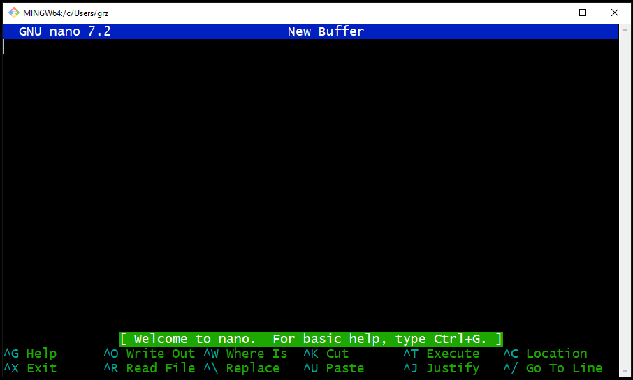
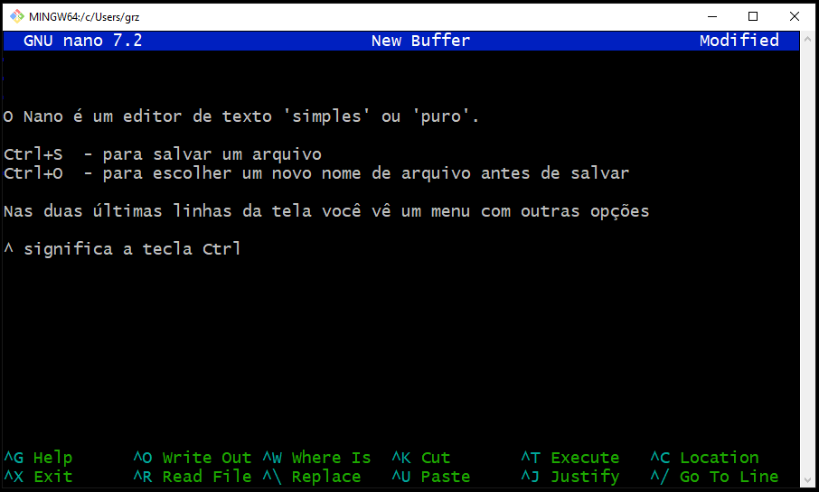
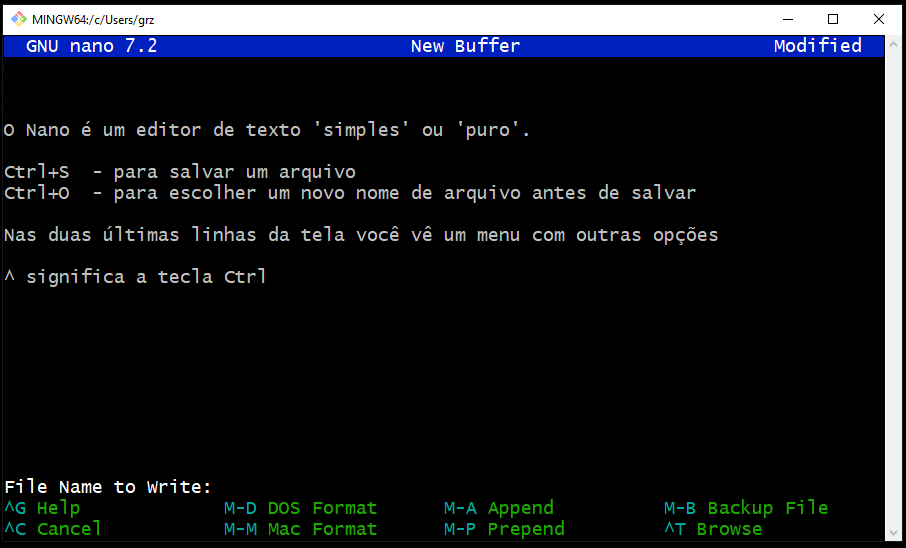
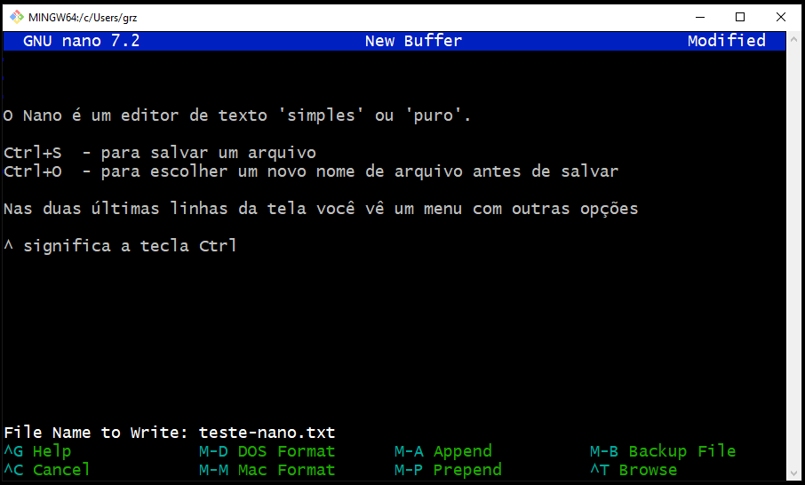
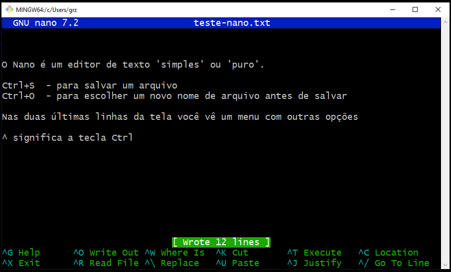
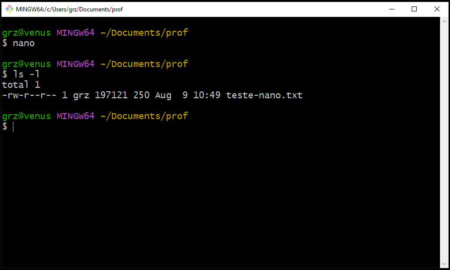
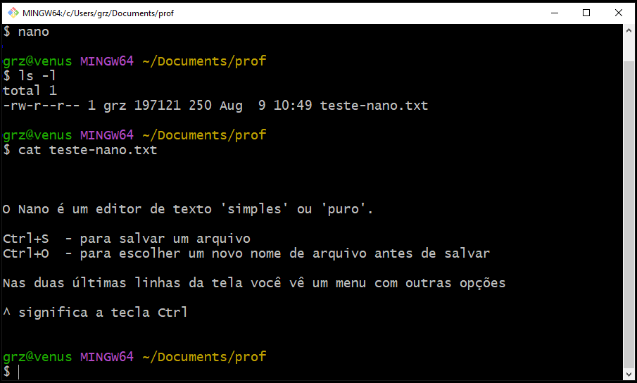

# O editor de textos `nano`

O `nano` é um editor de 'texto simples' ou 'texto puro'. Texto simples é um texto que contém apenas caracteres comuns (letras e números) e alguns caracteres especiais chamados 'caracteres de controle'.

O `nano` é também um programa que roda em `modo texto`, ou seja, ele não tem uma interface gráfica para o usuário, mas sim uma interface toda 'desenhada' apenas com caracteres.

> Programas em modo texto são o padrão para uso em terminais como o BASH, que também funcionam em modo texto.

## Abrir o `nano`
Para abrir o nano, na linha de comando do BASH você digita `nano`.

``` bash
$nano
```
A tela do `nano` que vai aparecer é parecida com esta:




Digitamos o texto normalmente. 

## Usar o menu do `nano`

Nas últimas linhas da tela do `nano` você vê um menu com vários comandos.

> O símbolo `^` antes das Letras significa  `ctrl`.

Para executar um comando você tecla `ctrl`+`letra do comando`.

Exemplo:

Sair do `nano`:
```
^X - teclar `ctrl`+`x`
```
## Salvar um arquivo de texto

Para salvar o texto em um arquivo usamos:

- ctrl+s - para salvar o arquivo
- ctrl+o - para salvar o arquivo com outro nome



Note que está escrito `New Buffer` na barra de menu no topo da janela do nano.

> `Buffer` é um lugar onde dados ficam armazenados temporariamente para serem processados logo em seguida.

O texto fica guardado em um `Buffer` na memória RAM (volátil) do computador enquanto ele não é salvo no disco em um arquivo (memória não volátil). 



*nano pedindo um nome para o arquivo novo antes de salvá-lo em disco*

No caso de arquivos novos, como o que estamos escrevendo, eles não tem um nome ao serem criados. Por isso, ao salvar tanto faz se usamos `ctrl+s` ou `ctrl+o`, o nano pedirá sempre um nome para o arquivo.



*dando um nome ao arquivo que será salvo*



*Nano informando que o arquivo foi salvo (número de linhas de texto que foram gravadas)*

> Para sair do `nano` tecle `ctrl+x`.

Sempre que termina a execução de um programa em linha de comando nós somos devolvidos ao prompt de comandos, para continuar trabalhando.

De volta ao prompt, confira que o novo arquivo foi criado listando o diretório
``` bash
$ls -l
```



*listagem do diretório confirmando que o arquivo foi salvo*

Agora confirme que os dados estão lá no arquivo usando o `cat` para imprimir o conteúdo do arquivo.

``` bash
$cat teste-nano.txt
```


*conteúdo do arquivo impresso no terminal usando `cat`* 

Para editar o arquivo de novo agora basta abrí-lo no nano. Você pode fazer isso na linha de comando passando o nome do arquivo como parâmetro para o nano.

```bash
$nano teste-nano.txt
```